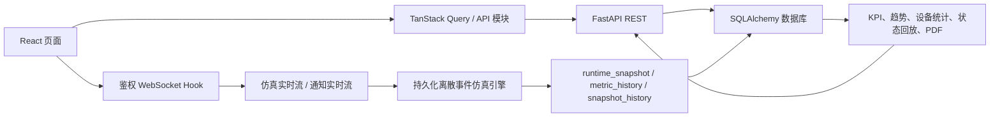

# 前端 ↔ 后端连通性与真实性审计

> 状态日期：2026-07-19  
> 审计范围：前端数据来源、HTTP/WS 契约、仿真与报告数据链、Mock 隔离、环境配置  
> 本文描述的是完成修复后的代码状态，不再沿用早期审计中的过期结论。

## 1. 最终结论

当前项目已经形成真实的前后端闭环：认证、项目、场景、仿真、进化、报告、资源、编排、通知、搜索与审计日志均存在后端端点和前端调用。仿真运行由后端持久化离散事件引擎驱动，前端通过鉴权 WebSocket 接收状态；报告数据来自运行时快照和指标历史，不再通过页面常量伪造。

需要明确区分两种数据：

- **业务数据**：项目、场景、仿真、指标、设备、报告、通知等，默认走真实 API。
- **产品配置**：首页介绍、编辑器设备目录、控制台字段定义、导出菜单等，属于稳定的界面配置，可以随前端版本发布，不应被称为 Mock 业务数据。

项目目前是可运行、可验证的工程级原型，但仍不是连接 PLC/WMS 的生产工业数字孪生，也不提供刚体物理认证或视频录像。这些属于后续产品边界，不是前后端断裂。

## 2. 过期结论更正

| 早期结论 | 当前事实 | 状态 |
|---|---|---|
| 后端没有 `/simulations/{id}/stream` | `services/api/app/main.py` 已实现鉴权仿真 WebSocket | 已更正 |
| `/api` 代理不支持 WebSocket | `apps/web/vite.config.ts` 的 `/api` 代理已配置 `ws: true` | 已修复 |
| 仿真是 `elapsed * robots` 假公式 | `SimulationService` 已实现可复现的任务派发、路径移动、安全距离、装卸、回充、拥堵与能耗 | 已更正 |
| 进化只做固定 `+0.15` | 后端按多个策略与种子执行试验并产生版本对比 | 已更正 |
| 资源、编排大量返回常量 | 资源由数据库初始化并读取；编排数据由项目、场景和仿真快照派生 | 已更正 |
| 项目没有开发环境文件 | 已有 `.env.development`、`.env.example` 和 `.env.test` | 已更正 |
| 页面直接依赖 `@ican/mock-data` | 页面层直接 import 已清除；Mock 仅存在于 API 模块的显式回退分支 | 已修复 |
| 设备利用率和回放是占位 | 设备统计来自机器人计数器；回放来自持久化状态帧 | 已修复 |

## 3. 数据流总览



## 4. 模块真实性矩阵

| 模块 | 前端入口 | 后端数据源 | 当前评价 |
|---|---|---|---|
| 登录、注册、找回密码 | Auth API | 用户、令牌、重置凭据 | 真实闭环 |
| 首页看板 | Dashboard API | 项目/场景/仿真聚合 | 真实；营销文案为产品配置 |
| 项目与成员 | Project API | 项目、成员、文件、工作区 | 真实闭环并有权限控制 |
| 场景编辑 | Scenario API | 场景、校验、版本记录 | 真实闭环；设备目录为产品配置 |
| 仿真运行 | REST + WebSocket | 后端离散事件引擎与持久快照 | 真实闭环，可断线续跑 |
| 方案进化 | Evolution API | 多策略、多随机种子评估 | 真实计算，可应用为新场景 |
| 运行报告 | Report API | metrics/history/events/runtime snapshots | 真实派生 |
| 设备利用率 | Report API | active/idle/charging、distance、tasks、故障关联 | 真实采集，不再用 elapsed 合成 |
| 日志回放 | Report API | 最多 300 个轻量状态帧 | 可播放、暂停、倍速、拖动、逐帧查看 |
| 资源中心 | Resource API | 资源表和模板表 | 真实读取 |
| 编排中心 | Orchestration API | 项目、场景、仿真与任务快照 | 数据驱动 |
| 搜索 | Search API | 数据库多类型查询 | 真实，支持分页/类型过滤 |
| 通知 | REST + WebSocket | 通知表与变更推送 | 真实实时闭环 |
| 审计日志 | Audit API | 后端审计记录 | 真实且管理员受控 |

## 5. 仿真与报告闭环

### 5.1 仿真运行时

每个运行保存：

- `runtime_snapshot`：机器人、任务、位置、电量、状态、路线和任务生命周期；
- `metric_history`：完成率、平均耗时、拥堵、能耗、避碰、待处理任务；
- `snapshot_history`：用于报告回放的轻量状态帧，保留最近 300 帧；
- `events`：异常类型、描述、严重度、发生时间与关联机器人。

实时 WebSocket 每秒推进并持久化状态；批量运行每 60 个仿真秒采样一帧。停止运行会同时清空历史与运行快照，避免新一轮混入旧报告。

### 5.2 设备统计

每台机器人累计：

- `active_seconds`：运输、装载、卸载、返回等活动时间；
- `charging_seconds`：充电时间；
- `idle_seconds`：空闲时间；
- `distance`、`energy`、`completed_tasks`、`waiting_seconds`。

报告利用率为 `active_seconds / runtime.time`，里程由仿真坐标厘米换算为米，任务数直接读取机器人完成计数，故障数仅统计与该机器人关联的异常事件。

### 5.3 状态回放

`GET /api/v1/reports/{simulation_id}/log-playback` 返回：

```json
{
  "runId": "...",
  "totalDuration": "00:12:00",
  "currentTime": "00:00:00",
  "frameCount": 12,
  "frames": [
    {
      "time": 60,
      "robots": [{ "id": "agv-01", "x": 120, "y": 280, "state": "to_pickup", "battery": 93.1 }],
      "metrics": { "completion_rate": 0.25 },
      "tasks": { "total": 20, "completed": 5 }
    }
  ],
  "events": []
}
```

这里的“回放”是结构化数字孪生状态回放，不是 MP4 视频。前端根据真实帧提供播放、暂停、0.5x/1x/2x、下一帧与时间轴拖动。

## 6. Mock 与产品配置边界

### 6.1 Mock 规则

- `.env.development` 与 `.env.example` 默认 `VITE_USE_MOCK=false`；
- `.env.test` 使用 Mock，保证前端单元测试不依赖后端进程；
- 页面不得直接 import `@ican/mock-data`；
- 只有 API 模块可以根据 `isMockEnabled(module)` 返回 Mock 数据；
- 生产构建未显式启用 Mock 时走真实后端。

### 6.2 产品配置位置

| 文件 | 内容 | 为什么不后端化 |
|---|---|---|
| `src/config/productContent.ts` | 首页文案、示例需求、流程与特性 | 产品展示配置，随版本发布 |
| `src/config/editorCatalog.ts` | 编辑器设备组件目录 | 前端画布能力清单 |
| `src/config/simulationConsole.ts` | KPI 字段与空状态描述 | 展示元数据，不承载运行值 |
| `src/config/evolutionExports.ts` | PDF/JSON 导出选项 | 操作菜单配置 |

帮助页学习路径不再读取本地常量，已通过 `useLearningPath()` 使用资源后端。

## 7. 网络与响应契约

- HTTP 基础路径：`/api/v1`；开发代理指向后端服务；
- 仿真 WS：`/api/v1/simulations/{id}/stream?token=...`；
- 通知 WS：`/api/v1/notifications/stream?token=...`；
- `/api` proxy 已开启 `ws: true`，也支持通过 `VITE_WS_URL` 直连后端；
- HTTP 拦截器只有在响应同时包含 `code`、`message`、`data` 时才解包信封，普通包含 `code` 字段的 DTO 不会被误判。

## 8. 当前产品边界与后续增强

以下内容可以继续增强，但不应再描述为“当前前后端没有连通”：

1. 当前离散事件引擎用于业务决策与可复现对比，不是 Gazebo/Isaac Sim 级刚体物理仿真。
2. AGV 路网和避碰为平台模型，不等同于厂商控制器或现场 PLC 的安全认证。
3. 状态回放保留最近 300 个采样帧，适合运行分析；长周期生产可改为独立快照表和对象存储。
4. SQLite 适合本地演示和单机开发；多用户生产环境应切换 PostgreSQL、Redis 和任务队列。
5. PDF 已能导出业务报告；若用于正式汇报，可继续加入 ECharts 服务端截图、品牌模板和分页目录。

## 9. 验证基线

本轮完成项的自动验证包括：

- 后端 `py_compile`；
- 后端 API/基础设施测试 17 项；
- 前端 TypeScript 类型检查、ESLint、Vitest 和生产构建；
- 页面层不得直接引用 `@ican/mock-data`；
- 设备里程、任务数与回放帧新增接口断言。

以后若再做连通性审计，应以本报告和当前自动测试为基线，不应复用早期“无 WS、假公式、无环境文件”的结论。
